# **Apuntes importantes del curso**

## **Indice**
- [Shortcuts](#Shortcuts)
- [Introducción a HTML](#sección-2---introducción-a-html---qué-es-etiquetas-y-básicos)
- [Introducción a CSS](#sección-3---introducción-a-css)
- [Introducción Flexbox y CSS Grid](#sección-4---introducción-flexbox-y-css-grid)
- [Ecommerce - Finalizando pagina de inicio](#sección-5---ecommerce-finalizando-la-página-de-inicio)
- [Ecommerce - Formulario HTML](#sección-7---ecommerce-formulario-html)
- [Flexbox: básicos, propiedades y más](#sección-8---flexbox-básicos-propiedades-y-más)
- [CSS Grid: básicos, propiedades y más](#sección-9---css-grid-básicos-propiedades-y-más)
- [Selectores CSS](#sección-10---selectores-css---todo-lo-que-tenes-que-saber)
- [Introducción a Responsive Web Design](#sección-11---introducción-a-responsive-web-design)
- [Ecommerce - Agregando Media Queries](#sección-12---ecommerce-agregando-media-queries-para-convertirlo-en-responsive)
- [Sitio Web para audífonos](#sección-13---sitio-Web-para-audífonos)
- [Sitio Web Arquitectura](#sección-14---sitio-web-arquitectura)
- [Introducción a BEM](#sección-15---introducción-a-bem)
- [Nucleus - Creando un proyecto desde 0 con BEM](#sección-16---nucleus-creando-un-proyecto-desde-0-con-bem)
- [Introducción a SASS y GULP](#sección-17---introducción-a-sass-y-gulp)
- [Cafetería - Creando un proyecto de 0 con SASS y Gulp](#sección-19---cafetería---creando-un-proyecto-completo-con-sass-y-gulp)
- [DeliveryApp - BEM y SASS](#sección-20---delivery-app-bem-y-sass)
- [PodcastApp](#sección-21---podcastapp)
- [AirbnbApp - BEM y SASS](#sección-22---airbnb-bem-y-sass)
- [Real State - Sitio de ventas de casas de lujo](#sección-23---real-state-sitio-de-ventas-de-casas-de-lujo)

## **Shortcuts**
1. Duplicar lineas:
    - Pararse al final de la linea
    - Shift + alt + flecha hacia abajo
2. Vista preliminar de archivo .md: Ctrl+Shift+v
3. Mantener apretado Alt y seleccionar todas las lineas que se quieran modificar con el mismo texto en simultaneo
4. Ctrl+l: Seleccionar toda la linea sobre la que estoy posicionado
5. Panel para configurar Snippets: Ctrl + Shift + P
6. Ctrl+D: Selecciona una a uno los textos debajo que coincidan con lo seleccionado.
7. Ctrl+Shift+L: Selecciona de una sola vez, los textos debajo que coincidan con lo seleccionado.

## Otras herramientas
1. Para publicar los proyectos usaremos [Netlify](https://app.netlify.com/)
2. Practicar con Flexbox: [Froggy](https://flexboxfroggy.com/#es)
3. [Node.js](https://nodejs.org/en/download)
4. [Gulp](https://gulpjs.com/docs/en/getting-started/quick-start/)
5. [Can I Use](https://caniuse.com/) : Permite validar qué funciones, atributos y caracteristicas de nuestro desarrollo son compatibles con todos los navegadores existentes
6. [Generador de vectores](https://getwaves.io/): Permite descargar vectores para adicionar en tu página

## **Sección 2 - Introducción a HTML - Qué es, etiquetas y básicos**

    Headings:
        Van del 1 al 6
        Se puede tener solo 1 H1 por página y 2 o 3 H2

    Extensiones de VSCode para HTML:
     1. Auto Rename Tag
     2. Auto Close Tag
     3. Auto Complete Tag
     4. Live Server
     5. vscode-icons
     6. CSS Peek

### Imagenes en HTML
    La etiqueta más común es  pero también existe la etiqueta <figure> que soporta multiples imagenes.

### Estructra básica de HTML

    <body>
        <header></header> <!-- Parte superior del sitio web o de un elemento -->
        <nav></nav> <!-- Grupo de enlaces o navegación -->
        <main> <!-- Contenido principal de un archivo .html - Solo 1 por archivo -->
        </main>
        <section></section> <!-- Cuando el primer hijo es un heading e introduce a una nueva sección -->
        <section></section>
        <aside></aside> <!-- Contenido que acompaña a la sección principal -->
        

 <!-- Cuando ninguno de los anteriores se puede utilizar -->
        <footer></footer><!-- Parte inferior del sitio web o de un elemento -->
    </body>
## **Sección 3 - Introducción a CSS**

### Colores:
    - Los colores se pueden definir por nombres(No se recomiendan), valores hexadecimal, RGB, HSL.
    En Hexadecimal #FFFFFF es blanco, mientras que #000000 es negro.

    RGBA() y HSLA() admiten transparecia además. Actualmente las funciones RGB t HSL también la admiten.

    - Para seleccionar 1 hijo dentro de los selectores se puede utilizar:
        a:first-child
        a:first-of-type (hace lo mismo wue first-child)
        a:last-child
        a:nth-child(1) -> El index es a partir de 1

### Especificidad
    - Mientras más específico sea el selector, menos aplicará el estilo de cascada.

    - El ID puede utilizar una vez por documento.

    - Para determinar nombres de clases o elementos, lo más común es que cuando hay más de 1 palabra se utilice el símbolo "-" para separarlas y las palabras en minúsculas.

    - Se miden por el siguiente parámetro
        0(!important) 0(Id) 0(Clases) 0(Etiquetas)

    - El sub-valor "!important" se coloca luego del valor en el selector css y es mayor a cualquiera de los otros

    - Es mejor práctica usar clases que id's

    - Existen distintas fórmas de escribir CSS siendo las más conocidas:
        A. Módulos: Se crea una clase padre y se seleccionan las etiquetas hijas luego
        B. BEM
        C. SMACSS

### Box Model
    En CSS todo es una caja, pero como sea esa caja y qué medidas tenga depende de:
        - Contenido
        - Padding
        - Borde
        - Margin
    
    Al agregar alguna de estas propiedades, podemos obtener un resultado no deseado

    Para que el tamaño del elemento no dependa de ninguno de estos factores, se puede agregar como atributo al selector:
        box-sizing: border-box;

    Por default el valor de ese atributo es "content-box"

#### Snippet para aplicar en todo el HTML
    html{
        box-sizing:border-box;
    }
    *, *:before, *:after{
        box-sizing: inherit;
    }

### Padding y Margin
    - Padding: Distancia interna de las esquinas del elemento al contendio
    - Margin: Distancia externa de las esquinas del elemento hacia el espacio por fuera

### Normalizar CSS
    Cada navegador agrega sus propios estilos por lo que esto podría generar errores si se abriera la misma página desde navegadores distintos.
    Por ello es que se suele utilizar frameworks/herramientas como:
        
[Link descargar normalize.css](https://necolas.github.io/normalize.css/)

### Display CSS
    Todos ya tienen uno por default
        1. block: Significa que un elemento se colocará por debajo de otro sin importar su tamaño o qué tanto contenido tiene
        2. inline: Se posicionará a la derecha una vez que haya tomado el espacio que requiere
        3. inline-block: permite darle width, height, margin a un elemento inline, lo que es posible hacer en un elemento "inline" y además se coloarán a la derecha.
        4. flex
        5. grid
### Imagenes como background en CSS
    Se usa el valor:
     background-image: url();

    Por default, las imagenes se repiten auntomáticamente. Para evitar esto:
        background-repeat: no-repeat;
## **Sección 4 - Introducción flexbox y css grid**

¿Cuándo utilizar cada uno?
    Flexbox:
        - Para la alineación o distribución de los elementos que estarán dentro de contenedores
    CSS Grid:
        Para definir el layout del sitio web, como pueden ser las columnas o contenedores de elementos.

### Flexbox
    Fue diseñado como un modelo unidimensional para crear layouts

    Siempre se debe añadir sobre el elemento padre sobre el que se quiere ordenar los hijos.
    NO se puede aplicar sobre los hijos directamente.

    Ejes: Se pueden colocar los elementos en 1 dirección:
        - Filas (row) (por default siempre es row):
            Mostrará los elementos de izquierda a derecha (row) o de derecha a izquierda (row-reverse)

            Los elementos se colocarán uno junto al otro.

        - Columnas (column):
            Mostrará los elementos de arriba a abajo.
#### Alineación horizontal y vertical
    Los valores que se pueden utilizar son: justify-content y align-items

    El contenido crece automáticamente

    - flex-direction = row
        . justify-content: es utilizado para alinear el contenido horizontalmente. Centro, izquierda o derecha
        . align-items: utilizado para alinear el contendio verticalmente. Arriba, centro o abajo.
    
    - flex-direction = column
        . justify-content: utilizado para alinear el contendio verticalmente. Arriba, centro o abajo.
        . align-items: es utilizado para alinear el contenido horizontalmente. Centro, izquierda o derecha

### CSS Grid
    Permite definir la ubicación y el tamaño de tu sitio web
    Permite distribuir los elementos bidimensionalmente.

    El contenido se agrupa dentro de un área definida.

    Para crear columnas:
        grid-template-columns

    Para crear filas:
        grid-template-rows

    Es posible definir un diseño:
        grid-template-areas

    ** Grid Lines ** 
        Son las lineas que separan los márgenes entre una fila y otra y una columna y otra
    
    ** Grid Track **
        Refiere a una división del grid que puede ser vertical u horizontal
    
    ** Grid Cell **
        Se habilita cuando se crean las áreas
    
    ** Grid Area **
        Se habilita cuando se deciden crean nombres en el grid
    
    Como unidad de medida, no se recomiendan usar los "px" sino los "fr"
#### Object fit
Cuando se configura un grid y hay 2 columnas por ejemplo, una de ellas con una imagen cuando la pantalla se hachica, la imagen podría no acompañar este tamaño.

        .galeria img{
            /* Esto hará que las imagenes tomen todo el ancho y alto disponible del espacio */
            object-fit: cover;
            height: 100%;
        }

## **Sección 5 - Ecommerce Finalizando la página de inicio**

### Fuentes
    Es posible añadir nuevas fuentes con la propiedad @font-face
        @font-face{
            font-family: nombreFuente;
            src: url(ubicacion.woff)
        }

    CONSIDERACIONES:
        - Algunas son de paga. Hay que tener en cuenta los derechos de autor.
        - Recomendable usar Google Fonts

    GOOGLE FONTS
        Si se descarga desde google fonts, se pueden seleccionar varias fuentes y añadirlas al HTML o al archivo CCS directamente

        La forma de usar las propiedades de la misma, se muestran dentro del mísmo panel:

### Unidades
    En algunas propiedades se pueden utilizar números negativos como es el caso de los márgenes que pueden tener -20px por ejemplo.

#### Absolutas
    Son exactas. Pueden ser cm, px, etc.

#### Relativas
    Toman el valor en base a otro elemento
    Algunos ejemplos son em, rem, vh, vw y porcentajes

    La ventaja es que se adaptan a mejores o menores resoluciones sin problemas. Son más escalables

    - em: Toma el valor en base a la medida del padre
    - vw: Toma como referencia el tamaño de la pantalla. No es tan recomendable porque algunos dispositivos no lo soportan.
    - rem (+ usado): Toman en consideración/referencia el tamaño de la etiqueta <html> (o del Document)
        Para poder hacer una conversión similar rem->px se puede agregar en el selector "html" lo siguiente:

        html{
            /* Hack para que 1 rem = 10px */
            font-size: 62.5%;
        }
### Formas de escribir código CSS:

Se pueden utilizar BEM, Módulos, SMACSS, Utilidades.
Cualquiera de las 4 te va a permitir completar un proyecto

Es posible utilizar todos los enfoques pero se recomienda siempre usar 1, máximo 2.

#### **BEM: Block Element Modifier**

    Se crea el bloque principal
        .card{}
    Los elementos contenidos se identificarán:
        .card__titulo{}
        .card__imagen{}
        .card__boton{}

    Si el elemento se modifica por alguna acción en particular:
        .card__boton--activo{}

#### **Utilidades**
    Ejemplos:
    .text-center{
        text-align: center;
    }

    .color-red-100{
        color: red;
        font-width: 10rem;
    }
    .bg-blue-200{
        background-color: blue;
        width: 20rem;
    }
    .p-2{
        padding: 2rem;
    }
    .m-2{
        margin: 2rem;
    }
#### **Módulos**
    .card{}
    .card h2{}
    .card img{}
    .card a{}

#### **SMACSS**
    Se basa en agrupar elementos según ciertas propiedades que comparten. Puede ser el tamaño, el color, etc. Ejemplo:

    #header, #article,#footer{
        width: 960px;
        margin: auto;
    }

    #article{
        border: solid #CCC
    }
## **Sección 7 - Ecommerce Formulario HTML**
    Dejar un input sin un label es una mala práctica
    <fielset> -> Permite agrupar elementos/inputs de un formulario
        <legend>Texto fieldset</legend> ->Permite darle un nombre de cabecera a ese fieldset
    </fieldset>

    Los labels e inputs tienen display:inline por default

    <textarea rows="20" cols="200">texto interno</textarea> -> Se puede utilizar para escribir textos largos. Los atributos rows y cols permiten definir el area de caracteres/filas que debería ocupar el texto contenido. Se puede asignar de esa manera o mediante CSS. En esta etiqueta si se le quiere asignar un texto por defecto se debe colocar entre la etiqueta de aprtura y cierre a diferencia de otros inputs de text que se coloca en el atributo "value"

    <option value="0" disabled selected>-- Seleccione --</option> los atributos:
        - disabled: Para que no se pueda seleccionar esa opción.
        - selected: Para determinar una opción seleccionada por defecto al abrir la página.

    - Inputs type = "radio"/"checkbox":  Al asignarle al INPUT el atributo "name", la selección se limita a solo 1 opción correcta y no a múltiples 
   
        

            <label for="cliente">Cliente</label>
            <input type="radio" id="cliente" name="tipo">
        

        

            <label for="proveedor">Proveedor</label>
            <input type="radio" id="proveedor" name="tipo">
        

    - datalist: Es similar a un select. En muchas navegadores aún no es soportado.
        

            <label for="categoria">Categoriías de Interés</label>
            <input type="text" list="categorias" name="categorias">
            <datalist id="categorias">
                <option value="Cocina">
                <option value="Recamaras">
                <option value="Oficina">
                <option value="Interior">
                <option value="Exterior">
            </datalist>
        

## **Sección 8 - Flexbox: Básicos, propiedades y más**
### justify-content
#### Cuando flex-direction:row;
Los elementos se alinean horizontalmente. Los posibles valores que puede tomar justify-content son los siguientes:
1. flex-start/start (por default)
2. flex-end/end
3. center
4. space-around: Distribuye el espacio disponible del padre en todos los lados por igual por lo que los espacios de en medio de los elementos suelen ser el doble o la suma entre margen derecho del elemento 1 + margen izquierdo del elemento 2.
5. space-evenly: Distribuye de manera equitativa todos los espacios de enmedio dejando el sobrante a los márgenes.
6. space-beteen: Distribuye todo el espacio disponible de manera equitativa entre los elementos pero no por fuera
#### Cuando flex-direction:column;
Los elementos se alinean verticalmente. Los posibles valores que puede tomar justify-content son los siguientes:
1. flex-start/start (por default). Se posicionan en la parte superior.
2. flex-end/end
3. center
4. space-around: Distribuye el espacio disponible del padre en todos los lados por igual por lo que los espacios de en medio de los elementos suelen ser el doble o la suma entre margen derecho del elemento 1 + margen izquierdo del elemento 2.
5. space-evenly: Distribuye de manera equitativa todos los espacios de enmedio dejando el sobrante a los márgenes.
6. space-beteen: Distribuye todo el espacio disponible de manera equitativa entre los elementos pero no por fuera
### align-items
#### Cuando flex-direction:row;
Alinea los elementos sobre el eje vertical
1. stretch (default): Se estiran todos los elementos a toda la altura que haya disponible.
2. center: centra los items en la altura del padre.
3. flex-start: alinea los elementos arriba de todo.
4. flex-end: alinea los elementos abajo de todo.
5. center: lo centra vericalmente en el padre.
6. baseline (poco usado): Si uno de los elementos hijos es más chico que otro, se traza una linea base sobre ellos y los alinea:
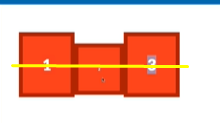
#### Cuando flex-direction:column;
Alinea los elementos sobre el eje horizontal
1. stretch (default): Se estiran todos los elementos a todo el ancho disponible disponible.
2. center: centra los items en la altura del padre.
3. flex-start: alinea los elementos arriba de todo.
4. flex-end: alinea los elementos abajo de todo.
5. center: lo centra vericalmente en el padre.
6. baseline (poco usado): Si uno de los elementos hijos es más chico que otro, se traza una linea base sobre ellos y los alinea.
### flex-basis
- **Se aplica sobre el elemento hijo**
Funciona similar a un width:
    * Si uso porcentajes, utiliza ese porcentaje del elemento padre.
    * Es un valor inicial, si el contenido ocupa más que ese valor inicial o de base, ocupará todo el espacio que necesite además de éste.
    * A diferencia de width ese setea un valor máximo sobre el elemento, es decir que si el contenido ocupa más lo que se especifica este siempre medirá lo que hayamos especificado como width por lo que el contenido podría quedar compacto o salirse del contenedor.
    * Soporta todas las unidades ya vistas.

### gap y calc
#### gap
- **Se agrega sobre el padre para añadir separación**
- No funciona en explorer
- Fue añadido recientemente. antes se usaba calc

#### calc
- Tiene más soporte en navegadores aniguos
- **Para generar una separación se debe agregar sobre los hijos**

Es una función de CSS que permite hacer calculos en general.
Anteriormente, para determinar el gap se debía restar el flex-basis - el tamaño del espacio que quería que se ocupe y luego con justify-content o align-items (según flex-direction) agrupar los elementos para que se muestre esa separación deseada.

### flex-wrap
- **Se agrega sobre el padre**

- nowrap (default): Esto hace que si los hijos exceden el limite del contenedor padre, se superpondrán a él en lugar de crear nuevas lineas:
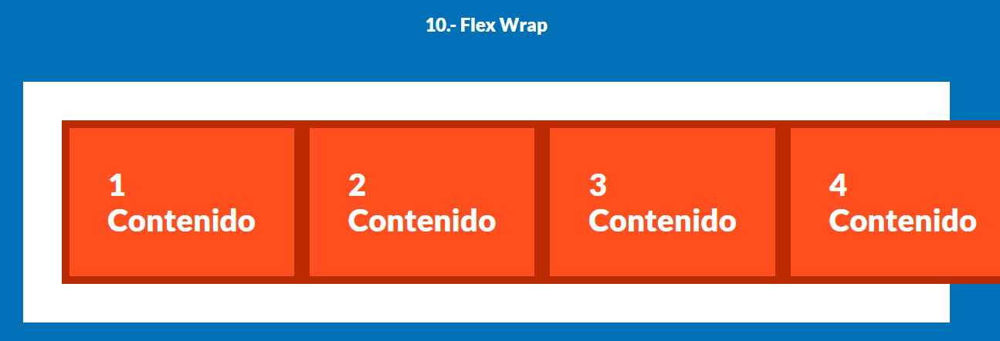
- wrap: Permite el salto de linea/columna (dependiendo de flex-direction)

### flex-grow
- Se trata del factor de crecimiento.
- **Se establece sobre los hijos**
- Reparte de forma equitativa los espacios disponibles a cada uno de los hijos hasta agotarse el espacio (si para todos los hijos es el mismo factor de crecimiento)

- flex-grow: 0; (default)

    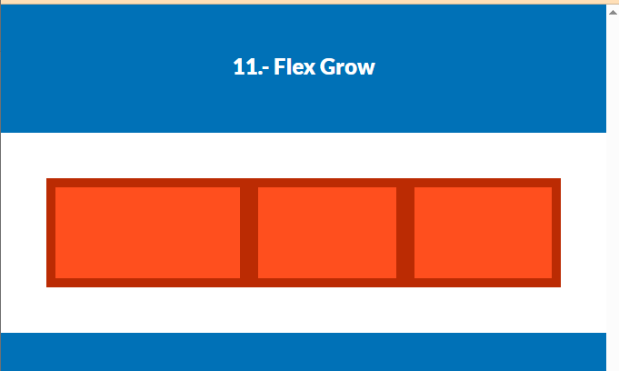

### flex-shrink
- Es el factor de contracción (contrario a flex-grow)
- flex-shink: 1; (default)
- **Se aplica sobre el hijo**

A medida que la pantalla se achica o la cantidad de elementos en el contenedor va aumentando, es en base a este valor que se van contrayendo:
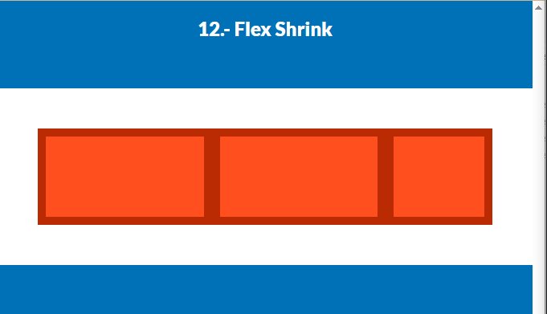

### flex-shorthand
- Es flex-grow, flex-shrink y flex-basis en un solo comando
- **Se aplica sobre el hijo/hijos**

flex: (flex-grow) (flex-shrink) (flex-basis)

## **Sección 9 - CSS Grid: Básicos, propiedades y más**
### grid-template-columns y grid-template-rows
- Para el caso de grid-template-columns, si defino las columnas y la cantidad de elementos no caben en ellas, automáticamente se generará un salto de página.
-  Para el caso de grid-template-rows, si defino solo algunas filas, y hay más elementos que las filas definidas, igualmente se crearán nuevas filas. La diferencia es que las declaradas van a poder mantener un formato establecido según el grid, mientras que las otras no.

Se puede utilizar para ambos la función: repeat({cantidad de veces},{tamaño})

Para ambos casos se puede cambiar el <u>posicionamiento de los hijos</u> con las propiedades de "**grid-column**" o "**grid-row**" según corresponda

### grid span
La palabra reservada **span** sirve para que en lugar de determinar el espacio que ocupa un elemento en la cuadricula del grid de manera explicita (ej. 2/4) pueda hacerse de a siguiente manera:
    "2 / span 3" -> Es decir que iniciará en la arista 2 y se expandirá hasta 3 aristas por lo que terminará ocupando hasta la 5ta arista

### grid shorthand
Se puede utilizar la siguiente sintaxis para decalarar filas y columnas:

    grid: {Filas} / {Columnas};
    Ej.: grid: repeat(2,300px) / repeat(3,300px);

### grid-auto-flow
Por default, su valor es "initial" pero puede cambiarse.
Se puede utilizar principalmente cuando se quiere ubicar una celda en posición de otra. Normalmente, con el valor por defecto, lo que sucede es que quedan espacios en blanco. Para que ello no ocurra es que sirve esta propiedad
- Se coloca en el padre:

Sin grid-auto-flow:

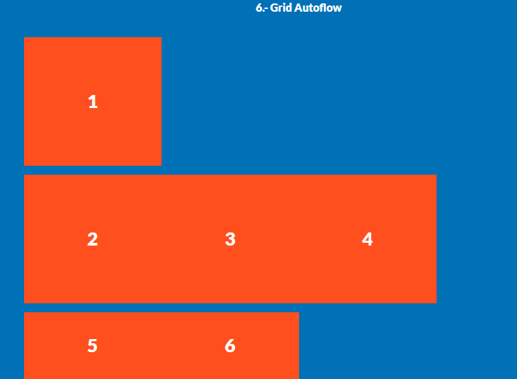

Con grid-auto-flow:

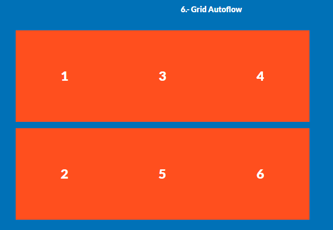

### grid gap
Es buena práctica eliminar el margin si se va a aplicar gap sobre la tabla para evitar que el espacio en el item dentro de la grid sea más paqueño.

- Se aplica en el padre
- El margin se quita directamente desde los hijos

    Existen propiedades:
        - row-gap
        - column-gap

    Pero también está el shorthand:

            - gap: {row-gap} {column-gap}; (Si ambas son iguales, se puede reducir a solo 1 parámetro).

### grid areas
Permite asignar nombres a cada una de las celdas del grid.

Existe una manera de mostrar los nombres de las areas desde las herramientas de desarrollador del navegado:

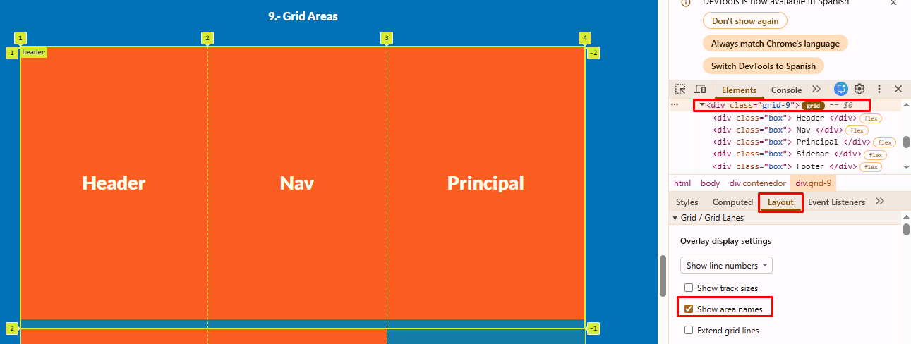

Se puede complementar con **grid-template-columns** para designar los tamaños

- la propiedad **grid-template-areas** se aplica sobre el **padre**.

        La forma de uso es la siguiente:
            grid-template-areas:    "header header header"
                                "nav nav nav"
                                "contenido contenido sidebar"
                                "footer footer footer";

Luego, se puede determinar el lugar de cada elemento/hijo dentro del grid con la popiedad

- grid-area: se aplica sobre el hijo

        .grid-9 .box:nth-child(1){
            grid-area: header;
        }
ACLARACIÓN: No se necesita usar las comillas para designarlo. De esta manera estamos haciendo que ese item tome toda la primer fila

En páginas responsive no suele ser la mejor opción

### grid-template

Se trata de un shorthand que incluye grid-template-areas, grid-template-columns y grid-template-rows

- Se utiliza de la siguiente manera sobre el **padre**

        grid-template:    "header header header" 2.5fr
                            "nav nav nav" 1fr
                            "contenido contenido sidebar" 6fr
                            "footer footer footer" 2.5fr / 1fr 1fr 1fr;

ACLARACIÓN IMPORTANTE: El tamaño de las columnas se setea en la última fila nada más porque sino no funciona.

### Alineación en Grid

- Se aplican dentro del padre. Tenemos las siguientes opciones:
    - Eje vertical:
        - Grid/ align-items: (stretch: valor por defecto)
            Permite alinear los elementos en el eje vertical

        - place-content y/ align-conent: funcionan de la misma manera que align-items. 
    
    - Eje horizontal:
        Se pueden alinear con:

        place-items: center

### Grid Autofill y Autofit

- Se utilizan sobre el padre de la siguiente manera:

    - **auto-fill**: Intenta por default crear **todas las columnas posibles** con un ancho igual para todos los items según el **espacio disponible** aunque queden vacías.

    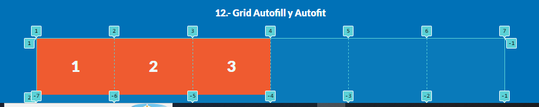

    Se usa de la siguiente manera:

        .grid-12{
            display: grid;
            grid-template-columns: repeat(auto-fill,200px);
        }

    - **auto-fit**: Crea una columna por cada item dentro del grid sin tener en cuenta el espacio vacío.

    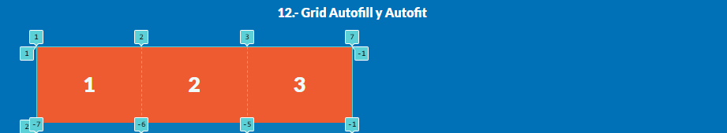

    Se usa de la siguiente manera:

        .grid-12{
            display: grid;
            grid-template-columns: repeat(auto-fit,200px);
        }

    **IMPORTANTE**: Ninguna de las 2 propiedades funcionan con la unidad de medida "fr". Para poder integrarlas, debemos usar la función "**minmax()**"

    - **auto-fit + fr**: 

        Se usa de la siguiente manera

            .grid-12{
                display: grid;
                /* Esto determina el valor minimo del item va a ser de 20 rem y el máximo de 1fr. Si llega a su valor mínimo, se crearan saltos de linea en lugar de nuevas columnas, es decir que cada elemento ocupará una fila entera. */
                grid-template-columns: repeat(auto-fit,minmax(20rem,1fr));
            }

        Valor máximo:

        

        Valor mínimo:

        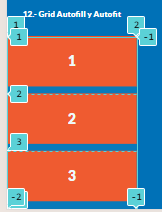

## **Sección 10 - Selectores CSS - Todo lo que tenes que saber**

### Primer Elemento después de...

    .clase > div+p{
        background-color:blue;
    }

### Atributo

    a[href="https://www.google.com.ar"]{
        background-color:blue;
    }

Esto significa que debe comenzar con..

    a[href^="https"]{
        background-color:blue;
    }

Esto significa que debe finalizar con..

    a[href$=".com"]{
        background-color:blue;
    }

### Primer elemento

- :first-child
- :first-of-type

### Ultimo elemento
- :last-child
- :last-of-type

### Seleccionar cualquier elemento

- :nth-child({número de elemento})

Esto permite seleccionar los elementos según un criterio de multiplicación y suma:

- Selección de un elemento si, el otro no. Podría ponerse "2n + 1" (selecciona los números impares), "4n + 4" (de 4 en 4), etc :
    - :nth-child(2n + 1){}

        Sería como hacer:
        2 * (0) + 1 = 1
        2 * (1) + 1 = 2
        2 * (2) + 1 = 5
        2 * (3) + 1 = 7
        2 * (4) + 1 = 9
        ...
    - :nth-child(odd): Realiza la misma acción que el punto anterior sobre los números **impares**
    - :nth-child(even): Realiza la misma acción que el punto anterior sobre los números **pares**

### Seleccionar todos los elementos excepto uno o unos

- Todos menos el elemento p que tiene la clase "texto"
    p:not(.text){}

- Todos los elementos excepto 2 que posean la siguientes clases
    - Ok: Esta es la manera correcta de seleccionar 2 elementos con clases distintas
    
            p:not(.text):not(.oferta){
                color: red;
            }
    
    - Error:

            p:not(.text),
            p:not(.oferta){
                color:red;
            }

### Primer linea o primer palabra

- Primer letra:

        .texto::first-letter{
            color: red;
        }
    
- Primer Linea:

        .text::first-line{
            color:red;
        }
    
## **Sección 11 - Introducción a Responsive Web design**

### Media queries

La sintaxis principal es la siguiente:

        @media print {
            body{
                background-color: red;
            }
        }

    Para este caso, estoy indicando que si deseo imprimir la pagina, el elemento cambie el valor de su atributo

Las media queries son principalmente últiles cuando la página se puede abrir en multiples dispositivos

Los **rem no son soportados**. Tienen que ser pixeles o densidad de pixeles

        @media (max-width: 600px){
            body{
                background-color:red;
            }
        }

    En este caso, estoy indicando que de 0 a 600px, el color de fondo será distinto. Se pueden agregar todos los elementos necesarios dentro de la media query.

        @media (max-width: 600px){
            .oferta{
                max-width: 30rem;
            }
            .precio{
                font-size: 2rem;
            }
        }
    
    En este otro, se estan modificando los tamaños de los elementos de 2 clases distintas.

### Herramientas para desarrollar de manera responsive

- A través de las Developer Tools del navegador
- [Responsively App](https://responsively.app/)

### Media queries al estilo de Mobile First
- Es el más común de todos

La idea es iniciar desde un tamaño más pequeño (en mobile) y luego ir ajustando con media queries para tamaños más grandes

1. Primero debemos escribir CSS *sin* media queries y luego se van agregando conforme vamos probando en pantallas cada vez más **grandes**.
2. Cuando trabajamos con este framework solemos usar **min-width**
    Esto significa que hasta ese mínimo las regla se omite. Ejemplo:

        @media (min-width:600px){

        }

        De 0 a 599px se ignora el media query pero si el ancho del documento es a partir de 600px la considera
3. Vamos considerando resoluciones cada vez más **grandes**.
### Media queries al estilo de Desktop First

La idea es iniciar desde un tamaño más grande (en Desktop) y luego ir ajustando con media queries para tamaños más pequeños

1. Primero debemos escribir CSS *sin* media queries y luego se van agregando conforme vamos probando en pantallas cada vez más **pequeñas**.
2. Cuando trabajamos con este framework solemos usar **max-width**
    Esto significa que hasta ese maximo las regla se considera. Ejemplo:

        @media (max-width:600px){

        }

        De 0 a 600px se considera el media query
3. Vamos considerando resoluciones cada vez más **pequeñas**.

### Media queries entre 2 tamaños

Hacer lo siguiente:

    @media(min-width:600px){
        .oferta{
            background-color: yellow;
        }
    }

    @media(min-width:800px){
        .oferta{
            background-color: #00446e;
        }
    }

Es lo mismo que esto:

    @media (min-width:600px) and (max-width:800px){
        .oferta{
            background-color: yellow;
        }
    }

Si quisiera aplicar el mismo código CSS en otras resoluciones podría hacerlo del siguiente modo:

    @media (min-width:600px) and (max-width:800px), (min-width:1200px){
        .oferta{
            background-color: yellow;
        }
    }

NOTA: Si se coloca un nuevo "and" va a fallar el código.

### Crear SNIPPET DE MEDIA QUERIES En Visual Studio Code

1. Ctrl + Shift + P
2. Buscar: User Snippets. En la siguiente ventana se puede buscar el lenguaje que se desee
3. Buscar "css.json"
4. Crear en formato json la siguiente estructura dentro de la ventana que abrirá luego:

        "media query3":{
            "prefix": "mq3",
            "body":[
                // Utilizamos place holder con $1: Permite posicionar el cursor en el lugar que queremos modificar eñ tamaño
                // Utilizamos el $2 para que una vez que demos tab sobre el primer cursor, vaya al segundo
                "@media (min-width: $1){\n\t$2\n}"
            ]
	    }
    
    - prefix: es la palabra que usaremos para llamar al atajo.
    - body: Es lo que me debería traer/imprimir en pantalla cuando yo coloque el prefix.
    - placeholders ($): Representan la siguiente posición a setearse al presionar la tecla "Tab"

    NOTA: Esto se podrá aplicar en todos los archivos CSS

### Tamaños standar para los Media Queries

Existen medidas standars, obviamente dependerá siempre del enfoque que se le de (Desktop First o Mobile First)

De acuerdo a bootstrap (Mobile First) los min-width deberían setearse con los siguientes tamaños:
- 576px (+576px)
- 768px (+768px)
- 992px (+992px)
- 1200px (+1200px)

Aunque por lo general, en la mayoría de los frameworks se encuentran los siguientes:
- 550px (telefono)
- 768px (tablet)
- 1024px (landscape)
- 1200px (laptop)
- 1600px (monitor)

Las que ya creamos se pueden llamar colocando en el archivo CSS la abreviatura "mq"

### Contenedores Responsives

Es ideal para ello utilizar medidas relativas, no exactas. Un ejemplo podría ser:

    .contenedor-responsive{
        background-color: #fff;
        /* width: 90%;
        max-width: 1000px; */
        width: min(90%,1000px);
        height: 400px;
        margin: 0 auto;
    }

La función "min(valor mínimo, valor máximo)" permite darle al contenedor la opción de ser responsive

### Columnas responsive en Flexbox

Ejemplo de como crear columnas con flex cuando la pantalla es mas grande que 768px o 1 columna por fila cuando es menor o igual

    @media (min-width: 768px){
        .tres-columnas-flex{
            display: flex;
            gap: 2rem;
        }
        .columna{
            flex-grow: 1;
        }
    }

### Columnas resonsive con CSS Grid

Ejemplo de uso con grid

    @media (min-width: 768px){
        .tres-columnas-grid{
            display: grid;
            grid-template-columns: repeat(auto-fit,minmax(20rem,1fr));
            gap: 2rem;
        }
    }

### Imagenes responsive

Lo ideal es siempre crear un .div que contenga esa imagen. De esa manera, la imagen se puede ajustar al tamaño del contenedor. Esto es mejor que aplicar un tamaño sobre la imagen directamente

Ejemplo:

    

        

            
        

    

Para aplicar correctamente que la imagen se ajuste debidamente, se debe agregar a los selectores generales del archivo CSS lo siguiente:

    img{
        max-width: 100%;
        display: block;
    }

Setear la propiedad "max-width: 100%" establece que:
1. La imagen no va a crecer más de los pixeles que mide: útil cuando la imagen tiene poca resolución.
2. Siempre va a ocupar el ancho máximo de su contenedor

Por default, las imagenes tienen display "inline" por defecto, por lo que si se les coloca algo debajo, por más que se elimine todo el padding y margin, va a dejar una separación mínima. Si se quiere que este pegado a la imagen, el valor de display debe ser "block"

### Imagenes en Avif y Wepp para mayor performance

A veces, dependiendo de la cantidad de imagenes que carguemos, el sitio puede empezar a hacerse pesado y afectar la performance.

- El formato ".png" o ".jpg", son los más soportados pero de los más pesados.
- El formato ".avif" no es soportado por la mayoría de los navegadores pero es el más liviano
- Le sigue el formato ".webp" que es soportado por la mayoría pero a modo parcial por safari

Para que el navegador tome la imagen que mejor performance tenga se puede hacer lo siguiente **sobre el HTML**:

    <picture>
        <source srcset="img/imagen.avif" type="image/avif" />
        <source srcset="img/imagen.webp" type="image/webp" />
        
    </picture>

El navegador seleccionará la mejor opción

#### Lazy loading
Muchas veces, el usuario no llega a recargar toda la pagina. Si utilizamos las imagenes para que se carguen apenas se abre la pagina y si la misma es pesada, el navegador tardará más en abrirla. Para ello podemos insertar el siguiente atributo sobre la **etiqueta HTML** que contiene la imagen:

    <picture>
        <source srcset="img/imagen.avif" type="image/avif" />
        <source srcset="img/imagen.webp" type="image/webp" />
        
    </picture>

### Servir imagenes más ligeras
En algunos casos, cuando la pantalla desde la cual se abre la pagina es pequeña, no tiene sentido servir imagenes de mucha resolución que a si mismo pesan más. Se puede optimizar esto del siguiente modo:

La etiqueta picture, admite multiples etiquetas "source" como vimos anteriormente. Pero la misma etiqueta source a su vez admite multiples atributos iguales. Para colocar el tamaño siempre es importante que cada uno de ellos termine con la letra "**w**"

Ejemplo:

    <picture>
        <source
            sizes="1920w, 1280w, 640w"
            srcset="img/imagen.avif 1920w
                    img/imagen-1000.avif 1280w
                    img/imagen-700.avif 640w"
            type="image/avif">
        <source
            sizes="1920w, 1280w, 640w"
            srcset="img/imagen.webp 1920w
                    img/imagen-1000.webp 1280w
                    img/imagen-700.webp 640w"
            type="image/webp">
        <source
            sizes="1920w, 1280w, 640w"
            srcset="img/imagen.jpg 1920w
                    img/imagen-1000.jpg 1280w
                    img/imagen-700.jpg 640w"
            type="image/jpeg">
        
    </picture>

#### Crear shorthand para las imagenes

1. Ctrl+shift+p
2. Colocar snippet en el buscador y buscar el archivo "html.json"
3. Crear el snippet

## **Sección 12 - Ecommerce: Agregando Media Queries para convertirlo en responsive**

Tips:
- Siempre es conveniente ir haciendo el sitio web responsive a medida que se va creando el HTML. NO a lo último.
- Importante el uso de las Developer Tools para trabajar: Allí se puede seleccionar el elemento a modificar y ver en qué archivo .css y en qué linea del mismo, ese elemento esta siendo modificado.

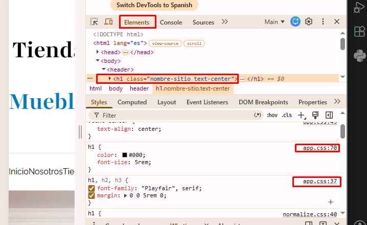

- Es ideal que cada elemento modificado con media queries se haga debajo de donde esta el primer elemento y no a lo último de la hoja de estilos ya que esto tiene desventajas tales como:
    - El .css se carga todo primero y después a lo último se tiene que re-convertir todo el HTML.
    - Es menos legible
## **Sección 13 - Sitio Web para audífonos**

### Introducción a Custom Properties
Se configuran al **inicio del archivo** css del siguiente modo y permite definir valores a través de variables que usaremos luego:

    :root{
        --fuentePrincipal: 'Roboto', sans-serif;
        --fuenteSecundaria: 'Lato', sans-serif;
    }

Dentro de las devtools aparecerá del siguiente modo:
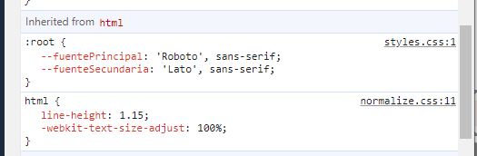

El modo de utilizarlo es el siguiente:

    body{
        font-family: var(--fuentePrincipal)
    }

Siempre se utiliza var(...)

Sirve especialmente para hacer escalar el código. En este caso, si a futuro quisieramos cambiar la fuenta general, lo podemos hacer facilmente desde las custom properties

### Setear un degradado sobre el texto

    .degradado-verde{
        /* Esto esta definiendo que el color del contenedor del texto tome ese color */
        background: linear-gradient(to right,var(--primario) 0%, var(--secundario) 100%);
        /* Pero esto que sigue permite asignar ese background directamente al texto */
        color: transparent;
        /* Esta forma es para que lo tome chrome */
        -webkit-background-clip: text;
        /* Esta otra para que lo tomen otros navegadores */
        background-clip: text;
    }

### Transform y Transition

#### Transform
Hay muchas maneras de transformar temporalmente un elemento:

- Modificar la escala del elemento

        .modelo:hover{
            transform: scale(1.1);
        }

- Rotar el elemento:

        .modelo:hover{
            transform: rotate(7deg);
        }

- Se pueden agregar multiples

        .modelo:hover{
            transform: rotate(7deg) scale(1.1);
        }

#### Transition

Para poder seleccionar a qué atributo quiero aplicar ese transform, debo colocar en el selector estatico lo siguiente:

- Esto hara que el transform aplique a todos los atributos que comprende el selector de CSS con la palara "all" seguido de cuánto quiero que dure la misma:

        .modelo {
            background-size: 15rem;
            transition: all 300ms;
        }

    [IMPORTANTE] Esto se considera una mala práctica

- Para que aplique a una/varias propiedades en particular:

        .modelo {
            transition-property: transform, background-size;
            transition-duration: 300ms;
        }

        .modelo:hover{
            transform: scale(1.1);
            background-size: 30rem;
        }
### Imagenes avif y webp como Backgorund

Para esto se debe utilizar una script de js que internamente usa la libreria [Modernizr](https://modernizr.com/)

Script
[codigoconjuan/imagenes.js](https://gist.github.com/codigoconjuan/3bbdf0f2920cd9c65187128dd1c032cc)

Este script que agregamos al código, inserta en la etiqueta html todos los tipos de imagenes soportadas por el navegador con el cual se abre el documento como clases:

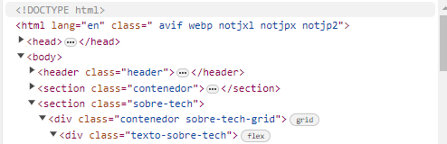

Estas clases que se agregan, luego las podremos seleccionar dentro de nuestro código CSS

Ver bien como se esta aplicando en el archivo styles.css

## **Sección 14 - Sitio Web Arquitectura**

### "::before" y "::after" en un selector de CSS

Esto permite agregar un nuevo elemento en el DOM antes o después del que se pretende seleccionar.

Es un pseudo elemento, el mismo no existe propiamente como una etiqueta en el HTML

La sintaxis básica es la siguiente:

    .telefono::before{
        content: '';
    }

En el atributo "content" es donde uno podría agregar lo que quiera, así mismo puede estar vacío si se quisiera, pero siempre debe existir en el selector.

los pseudo elementos ::before y ::after son tomados por defecto con un "display: inline" por lo que si queremos afectar su tamaño debemos colocarle 

    "display:block"

## **Sección 15 - Introducción a BEM**

Block Element Modifier

- Metodología que ayuda a crear componentes reutilizables.
- Es una serie de convenciones sobre como nombrar clases tanto en HTML como en CSS.
- Evita la creación de CSS anidado y también ayuda a identificar qué elementos se relacionan con otros.

Ejemplo de Módulos o eiquetas semánticas (Lo usado hasta ahora)

        HTML
        

            
            <h2>Producto</h2>
            <a href="producto.html>
        

        Selectores:
            .card{}
            .card h2{}
            .card img{}
            .card a{}

Ejemplo usando BEM

        

            
            <h2 class="card__titulo">Producto</h2>
            <a class="card__boton" href="producto.html>
        
 
        Selectores:
            .card{}
            .card__imagen{}
            .card__titulo{}
            .card__boton{}
        
        Supongamos que uno de estos mismos elementos se repite pero el color de fondo cambia uno de otro, usaremos un nuevo selector. Ejemplo:

            .card__titulo--rojo{}

**REGLAS de BEM**

- Utilizar una palabra para Bloques Elementos o Modificadores, pero si utilizas 2 palabras se puede usar **camelCase** o separarlas por 1 guión medio, ejemplo:

        card__precioProducto o card__precio-producto

- Un Bloque de BEM con sus elementos debe ser reutilizable, por lo tanto su apariencia no depende de otros bloques. Es decir, puedo copiar el HTML que posee esa clase a otro lugar y no debería verse afectado por ningún otro selector que no sean los correspondientes.

- En algunos casos puede que tengas que usar módulos, pero usarlo como **última opción**.

Ejemplo práctico usando un modificador:

        

            
$299

            
$199

        

        .producto__precio{
            font-size: 4rem;
            color: green;
            font-weight: 900;
            margin: 0;
        }

        .producto__precio--oferta{
            text-decoration: line-through;
            color: red;
        }

## **Sección 16 - Nucleus Creando un proyecto desde 0 con BEM**

Por medio de un selector CSS también podemos colocar que cierto estilo se aplique a un elemento que comience, termine, etc con alguna palabra:

    [class$="__contenedor"]{
        max-width: 120rem;
        margin: 0 auto;
        width: 90%;
    }

### Sombras a los elementos

Se utiliza de la siguiente manera:

    box-shadow: 0px 0px 15px 3px rgb(0 0 0 / .15);

Siendo los terminos ordenados del siguiente modo:

- Cuanto quiero que se aleje la sombra del elemento de forma vertical
- Cuanto quiero que se aleje la sombra del elemento de forma horizontal
- Blur: Cuanto espacio quiero que se proyecte la sombra
- Que tan gruesa quiero que sea la sombra
- El color de la sombra

### Diagonales en el background

#### Metodo 1 - transform + rotate()

    .seguridad{
        background-color: var(--primario);
        padding: 10rem 0;
        /* Hacemos una rotación de todo el contenedor */
        transform: rotate(3deg) scale(1.5);
        /* Es necesario agregar margin arriba y abajo para que se vean correctamente las diagonales */
        margin: 50rem 0;
    }

    @media (min-width: 768px){
        .seguridad{
            /* Es necesario agregar margin arriba y abajo para que se vean correctamente las diagonales */
            margin: 30rem 0;
        }
    }
    .seguridad__contenedor{
        /* Luego al contenido del contenedor padre lo rotamos porque al haberlo rotado, se rotará tambiém su contenido. Por lo que lo enderezamos */
        transform: rotate(-3deg) scale(.75);
    }

Así mismo, tendremos que crear la siguiente utilidad para evitar que haya un scroll de forma horizontal. Esta clase se la asignaremos como padre del contenido principal:

    

        <section class="seguridad">

    .mask{
        overflow: hidden;
    }

#### Metodo 2 - Position relative y absolute (Mejor opción)

Siempre tiene que haber un elemento que sirva de Guía. En este caso usaremos el elemento .seguridad:

    .seguridad{
        background-color: var(--primario);
        padding: 20rem 0;
        /* Siempre tiene que haber un elemento que sirva de Guía y al cual se le aplique la propiedad de position:relative */
        position: relative;
        margin: 10rem 0;
        overflow: hidden;
    }

    .seguridad::before,
    .seguridad::after{
        background-color: var(--blanco);
        content: '';
        height: 20rem;
        width: 120%;
        /* Al usar position relative y absolute, no es necesario usar display:block */
        /* Es absoluta respecto al elemento .seguridad */
        position: absolute;

    }
    .seguridad::before{
        top: -10rem;
        left: 0;
        transform: rotate(3deg);

    }

    .seguridad::after{
        bottom: -10rem;
        left: 0;
        transform: rotate(3deg);

    }

IMPORTANTE: La cantidad de margin sobre el elemento .seguridad, debe ser LA MISMA que la que se le está aplicando a los elementos .seguridad::before y .seguridad::after

## **Sección 17 - Introducción a SASS y GULP**

### SASS
- SASS = Syntatically Awesome StyleSheet
- Ya se le considera un estándar en la industria
- Compatible con muchos frameworks, incluyendo bootstrap
- Se lo puede considerar como un lenguaje de programación ya que tiene variables y funciones y más.

#### Ventajas
- Mejor orden y estructura en el código
- Caracteristicas que no existen en CSS o con mejor soporte.
- Soporta código CSS.
- Menos código ya que usa una sintáxis llamada anidación

#### Desventajas

- Se debe compilar con una herramienta especial ya que no es nativo del navegador.
- La anidación puede causar problemas

#### Sintáxis de SASS

- Debe compilarse y generarse un archivo .css
- Existen diferentes formas de compilación: webpack y **gulp** son las más conocidas.

##### Variables

    $color: #e1e1e1;
    $separacion: 5rem;

##### Anidación

    div
        display: flex;
        h1
            margin-top:10rem;
        p
            margin-top:10rem;

##### Extensión de archivos

Existen 2 tipos:
- .scss: Anterior. casi que no se usa
- .sass: nueva extensión

Se pueden importar ambas y suarlas en un mismo proyecto incluyendo archivos .css

###### Sintáxis de selectores en archivo .sass

    .header
        display: flex;
        .logo
            margin-top: 10rem;

- Ya no es necesario usar las llaves, solo basta con la identación
###### Sintáxis de selectores en archivo .scss

    .header{
        display: flex;
        .logo{
            margin-top: 10rem;
        }
    }

- Es necesario colocar las llaves

### GULP

Permite automatizar tareas con Java Script que suelen ser repetitivas en el desarrollo web. Entre las cuales se encuentran:

- Minificación de imágenes
- Crear formatos webp y avif para imagenes
- Minificar y optimizar código CSS o JavaScript
- Compilar SASS

Para utilizarlo, es necesario tener instalado:
 - Node y NPM

#### Pipes en Gulp

Cada tarea debe tener un orden, este orden se define por Pipes.

Los Pipes se definen por pasos a seguir y se ejecutan uno a uno según cada pipe vaya finalizando.

#### Instalarlo

1. Instalar el CLI de manera global:
    npm install --global gulp-cli

2. Manera de ver si quedó instalado:
    gulp -v
3. Es posible que si se quiere usar el comando de gulp -v en el powershell directamente aparezca el siguiente cartel de error:

        PS C:\Windows\system32> gulp -v
        [16:11:08] Local gulp not found in C:\Windows\system32
        [16:11:08] Try running: npm install gulp

Para solucionar eso debemos ejecutar como **administrador**:

        Set-ExecutionPolicy RemoteSigned -Scope LocalMachine
        Luego seleccionamos la opción "o"

## **Sección 19 - Cafetería - creando un proyecto completo con sass y gulp**

### Primeros pasos con GULP e instalando dependencias

1. npm init -> Creará el archivo package.json sobre el directorio
2. Una vez cargue, colocaremos el nombre al proyecto. Luego todo enter. Colocar el autor y enter hasta el fin
3. Se creará el archivo package.json
4. Instalar Gulp como dependencia del proyecto en desarrollo (es decir que se instalan de forma local en el proyecto): npm i --save-dev gulp
5. Si aparece el cartel de vulnerabilidades pasar el comando: npm audit fix
6. Si por alguna razón se elimina la carpeta node_modules es cuestion de ejecutar: npm i para que instale las dependencias seteadas en el package.json
7. Crear el archivo .gitignore para evitar que se suba la carpeta de node_modules
8. crear dentro del proyecto el archivo "gulpfile.js" que contendrá las "tareas" que puede reconocer gulp
### Crear primera tarea de Gulp
Dentro del archivo gulpfile.js setearemos el siguiente código

    function tarea(done){
        console.log('Desde mi primer tarea...');
        // El done es una función nativa que se llama para determinar que la tarea terminó
        done();
    }

    // Utilizamos esto para exportarla
    exports.tarea = tarea;

Para usarla, ejecutamos en la consola

    gulp tarea

### Compilar SASS/SCSS con Gulp

1. Crear archivo app.scss
2. Instalar 2 dependencias: 
    - npm i --save-dev sass gulp-sass
3. Dentro del archivo gulpfile.js setear lo siguiente:

    // Importaremos los elementos necesariosdel módulo de gulp
    const { src, dest } = require('gulp');
    const sass = require('gulp-sass')(require('sass'));

        function css(done) {
            // Compilar sass
            // Paso 1 - Identificar archivo scss
            // Paso 2 - Compilar
            // Paso 3 - Guardar el .css
            return src("./src/SCSS/app.scss")
                .pipe(sass())
                .pipe(dest('./build/css'));
        };
### Agregando un Watch

Comunmente, para que se apliquen los cambios del archivo .scss deberías compilar todo el tiempo.

    // Importaremos los elementos necesariosdel módulo de gulp
    const { src, dest,watch } = require('gulp');
    const sass = require('gulp-sass')(require('sass'));

    function css(done) {
        // Compilar sass
        // Paso 1 - Identificar archivo scss
        // Paso 2 - Compilar
        // Paso 3 - Guardar el .css
        return src("./src/SCSS/app.scss")
            .pipe(sass())
            .pipe(dest('./build/css'));
    };

    function dev(){
        watch("./src/SCSS/app.scss",css)

    }

    exports.dev = dev;

Luego llamamos a la función dev:

    gulp dev

Para salir del watch usamos Ctr+C

### Exportar CSS en diferentes estilos

A través de la función sass() dentro del módulo "gulp-sass" se puede determinar cómo quiero devolver el archivo css, es decir puede que todo el código se estire (comprima dentro de una misma linea), o bien que este identado para una mejor lectura

    function css(done) {
        // Compilar sass
        // Paso 1 - Identificar archivo scss
        // Paso 2 - Compilar
        // Paso 3 - Guardar el .css
        return src("./src/SCSS/app.scss")
            .pipe(sass({outputStyle: 'expanded'}))
            .pipe(dest('./build/css'));
    };

Algunos de los valores que se pueden colocar son:
- compressed (Agrupa todo el código en una mísma línea)
- expanded (Coloca el código bien identado)

### Añadir Autoprefixer

Son dependencias y como tal, se deben instalar:

    npm i --save-dev autoprefixer gulp-postcss

Permiten escribir código de última generación y nos van a crear versiones compatibles para navegadores que no la soportan.

Debemos para ello agregar una clave adicional en el archivo package.json:

    "browserslist":[
        "IE 10"
    ]

Una vez agregado, automáticamente al compilar agregará en el archivo .css lo que haga falta para que funcione con otros navegadores:

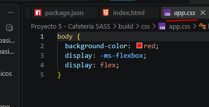

Para este curso, setearemos en el package.json dentro de la clave "browserslist" los siguientes items:
- La ultima versión del navegador que se utiliza
- Que tenga un soporte del atributo mayor al 1%

        "browserslist":[
            "last 1 version",
            "> 1%"
        ]

### Corriendo multiples tareas por default

Permite ejecutar por medio de gulp una tarea por default:

    // series - inicia una tarea, y hasta que finaliza, no ejecuta la siguiente
    exports.default = series(css,dev)
    // parallel ejecuta todas las tareas en simultaneo
    exports.default = parallel(css,dev)

Se a llama a través del comando:

    gulp default

### Dividir código de SASS en diferentes archivos

La siguiente imagen muestra cómo se debe crear el nombre del archivo para que desde un archivo de inicio de SASS (app.scss) se compile todo en un mismo .css. Para ello es primordial el "_"

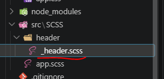

1. Dentro del .sass principal, debemos importar el otro de este modo:

        @use 'header/header';

        $color : red;

        body{
            background-color: $color;
            display: flex;
        }

Así mismo dentro del archivo principal (app.scss) vamos a poder usar variables del archivo _header.scss utilizando en app.scss por ejemeplo:

    header.$color  -> esto me trae una variable del archivo header

2. Luego, cuando gulp compila, agrega todo en el mismo archivo .css

### Escuchar los cambios en todos los archivos .scss

Uno de los problemas si tenemos archivos .scss por separados es que con lo que vimos hasta ahora, solo si modificamos el archivo app.scss es que gulp lo va a compilar. Eso es porque el watch solo esta escuchando dicho archivo.

Para hacer algo general podemos configurar la ruta en el watch con "comodines"
Para poder aplicar la configuración sobre todos los archivos .scss modificaremos el watch en nuestro archivo gulpfile.js:

    function dev(){
        watch("./src/SCSS/**/*.scss",css);

    };

### Utilizando @use y @forward

@forward: Sirve solo para incluir archivos dentro de otros pero nada más los va a incluir.

@use: Sirve para incluir archivos dentro de otros pero también va a utilizar el contenido.

@import: Sirve para incluir archivos dentro de otros pero también va a utilizar el contenido. (Deprecado)

Para ello, se incluyen dentro de un _index.scss todos los fowards a los archivos .scss complementarios. Luego en el archivo app.scss solo se usa @use y se pone el nombre de la **carpeta** donde esta el archivo _index.scss. Automáticamente va a reconocer que debe tomar ese y no otro.

### Importar variables de otros archivos

Se utiliza @use dentro del archivo que se pretende usar las variables. Incluso se le puede agregar un alias. Ejemplo:

    @use 'variables' as v;

### Crear una tarea para procesar las imagenes

Idealmente las imagenes se deben procesar también por gulp. Para ello lo agregaremos en el watch

    function imagenes(){

        return src('src/img/**/*')
            .pipe(dest('build/img'));

    };

    function dev(){
        watch("./src/SCSS/**/*.scss",css);
        watch("./src/img/**/*",imagenes);

    };

    // exports.dev = dev;
    // series - inicia una tarea, y hasta que finaliza, no ejecuta la siguiente
    exports.default = series(imagenes,css,dev);

### Aligerar imagenes con Gulp

Instalar dependencia gulp-imagemin:

    npm i --save-dev gulp-imagemin

Luego agregar pipe a la tarea de imagenes

    const imagemin = require('gulp-imagemin');

    function imagenes(){

        return src('src/img/**/*')
            .pipe(imagemin({optimizationLevel:3}))
            .pipe(dest('build/img'));
    };

    exports.default = series(imagenes,css,dev);

### Utilizar gulp para crear imagenes webp

Instalar dependencia:

    npm i --save-dev gulp-webp

Importamos la dependencia en el gulpfile.js, creamos la tarea y la agregamos a la tarea por defecto

    const webp = require('gulp-webp');

    function versionWebp(){
        return src('src/img/**/*.{jpg,png}')
            .pipe(webp())
            .pipe(dest('build/img'));
    };

    exports.default = series(imagenes,versionWebp,css,dev);

### Modificación del archivo gulpfile.js por gulpfile.mjs

Hubo que hacer esa modificación para que node.js reconozca el archivo como un archivo  de módulos y permita usar la clausula "import" y "export" dentro del código las cuales son necesarias para las nuevas versiones de gulp-imagemin y gulp-webp

### Utilizar gulp para crear imagenes avif (No se realiza)

Se realizaron modificaciones y no se incorporó al código ya que procesar las imagenes en formato avif es muy costoso para el CPU

### Mixins en SASS
Cuando en SASS hay un código que se va a usar mucho, lo ideal es usar un mixins

Se trata de un conjunto de atributos que se pueden aplicar dentro de un mismo selector. Sería algo así como una variable que contiene un conjunto de atributos y valores, no solo 1 nombre de variable y un valor

    @mixin color($color){
        color: $color;
    }

    y se usa

    @include mixins.color

### Mixins para Media Queries

Crearemos un archivo nuevo llamado _mixins.scss y dentro

    @mixin telefono{
        @media (min-width: v.$telefono){
            @content;

        }
    }

la directiva @content, nos permitirá dentro de donde lo usemos usar el mixin como un propio selector luego:

    @use 'base/variables' as v;
    @use 'base/mixins' as m;

    .header{
        padding: 5rem 0;
        position: relative;

        @include m.telefono{
            padding: 2rem 0;;
        }
    }

### Crear shorthand para Mixins
1. Ctrl+Shif+p
2. Buscamos los snippets y buscamos por scss.json
3. Escribimos los snippets:

    	"media query telefono": {
            "prefix": "mqmtel",
            "body": [
                "@include m.telefono {",
                "\t$1",
                "}"
            ]
        },
        "media query tablet": {
            "prefix": "mqmtab",
            "body": [
                "@include m.tablet {",
                "\t$1",
                "}"
            ]
        },
        "media query desktop": {
            "prefix": "mqmdesk",
            "body": [
                "@include m.desktop {",
                "\t$1",
                "}"
            ]
        },
        "media query generica": {
            "prefix": "mqm",
            "body": [
                "@include m.$1 {",
                "\t$2",
                "}"
            ]
        }

### Cálculos matemáticos con SASS

Se importa el módulo de SASS para ello:

    @use 'sass:math';

y se puede usar dentro del código de la siguiente manera:

        @include m.tablet {
            flex-direction: row;
            gap: math.div(v.$separacion,4);
        }

### Clausula @extend

Esta cáusula permite "copiar" dentro del selector que se la llama, los atributos de otro selector css (es decir que puede ser una etiqueta HTML, una clase, id, etc). Ejemplo:

    h2{
        font-size: 3.6rem;
        color: v.$primario;

        span{
            color: v.$secundario;
            font-size: 1.8rem;
            display: block;
        }

        &::after{
            content: '';
            display: block;
            width: 10rem;
            height: 10rem;
            background-image: url(../img/cafe.svg);
            background-repeat: no-repeat;
            background-size: cover;
            margin: 0 auto;
        }
    }

    .heading-blanco{
        @extend h2;
        color: v.$blanco;
        span{
            color: v.$blanco;
        }

    }

### propiedad CSS aspect-ratio

Permite que la imagen seteada como backgrund-image se agrande o se achique proporcionalmente de forma horizontal y vertical según proporción que indiquemos

    .contenido-menu{
        background-image: url(../img/cafe.jpg);
        background-repeat: no-repeat;
        background-position: center bottom;
        background-size: 100%;
        // Horizontal - Vertical
        aspect-ratio: 3/5;
    }

### Agregar un sourcemap al proyecto

Cuando el proyecto renderiza los archivos .scss, siempre termina generando un app.css y en el HTML nos referenciará a la linea de ese CSS donde se encuentra el selector.
Sabemos que el .css es un renderizado del .scss pero a simple vista desde el HTML no podríamos ubicar en qué archivo .scss esta realmente el selector.

Para ello instalaremos la dependencia:

    npm i --save-dev gulp-sourcemaps

Luego en el archivo gulp lo usamos en los pipes:

    import sourcemaps from 'gulp-sourcemaps';

    function css() {
        // Compilar sass
        // Paso 1 - Identificar archivo scss
        // Paso 2 - Compilar
        // Paso 3 - Guardar el .css
        return src("./src/SCSS/app.scss")
            .pipe(sourcemaps.init())
            .pipe(sass().on('error', sass.logError))
            .pipe(postcss([autoprefixer()]))
            .pipe(sourcemaps.write('.'))
            .pipe(dest('./build/css'));
    }

La linea que contiene la siguiente sentencia debe colocarse el "." para indicar que se debe escribir en el mismo directorio que el archivo .scss:

    .pipe(sourcemaps.write('.'))

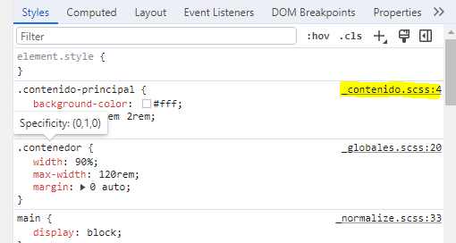

Se creará además el archivo app.css.map junto con el archivo app.css

### Mejorar el código con cssnano
Es probable que parte de nuestro código css resulte ser pesado. Incluso podríamos haber agrupado en clases de una mejor manera.
Para ello instalaremos la dependencia:

    npm i --save-dev cssnano

Luego lo agregamos el gulp file dentro de los pluggins de postcss:

    import cssnano from 'cssnano';

    function css() {
        // Compilar sass
        // Paso 1 - Identificar archivo scss
        // Paso 2 - Compilar
        // Paso 3 - Guardar el .css
        return src("./src/SCSS/app.scss")
            .pipe(sourcemaps.init())
            .pipe(sass().on('error', sass.logError))
            .pipe(postcss([autoprefixer(),cssnano()]))
            .pipe(sourcemaps.write('.'))
            .pipe(dest('./build/css'));
    }

## **Sección 20 - Delivery App: BEM y SASS**

Para cumplir con la sintaxis de BEM usando SASS este sería el modo correcto

HTML:

        <header class="header contenedor">
            

                
            

            <nav class="navegacion">
                <a href="#" class="navegacion__link">Iniciar sesión</a>
                <a href="#" class="navegacion__link">Crear cuenta</a>
                <a href="#" class="navegacion__link navegacion__link-registrar">Registrar restaurante</a>
            </nav>
        </header>

SCSS:

    .header{

        color:red;

        &__logo{
            color: green;
        }

    }

CSS:

    .header {
        color: red;
    }
    .header__logo {
        color: blue;
    }

### Función de SCSS darken()

Permite oscurecer de 0 a 100% un color pasado por parámetro:

    box-shadow: 0px 0px 2.6rem -.8rem darken(v.$grisClaro,20%);

### Función de SCSS lighten()
Permite aclarar de 0 a 100% un color pasado por parámetro:

    box-shadow: 0px 0px 2.6rem -.8rem lihgten(v.$grisClaro,20%);

## **Sección 21 - PodcastApp**

### Z-index

Es una propiedad CSS que se utiliza para traer al frente algún elemento. Lo ideal es que vaya de 100 en 100 para mantener un orden.

## **Sección 22 - Airbnb: BEM y SASS**

### Carrousel de imágenes

- Las imagenes tienen que tener un ancho fijo. No se las puede setear con "fr" por ejemplo.

        .lugares {
            &__grid {
                display: grid;
                grid-template-columns: repeat(4, 30rem);
                column-gap: 4rem;
                // Permite OCULTAR todo lo que este por fuera/se sale del contenido del view port sobre el eje Y
                overflow-y: hidden;
                // Permite hacer scroll de todo lo que este en el eje X
                overflow-x: scroll;
                // Esto informa qué tipo de scroll va a tener
                scroll-snap-type: x mandatory;
            }
        }

        .lugar{
            // Como al objeto padre le colocamos los overflows y el tipo de scroll. Al hijo vamos a decirle, en qué parte del scroll quiero que aparezcan
            scroll-snap-align: center;
        }

Existen distintos valores para **scroll-snap-align**:
- start o left
- center
- end o right

Podemos agregar esto mismo dentro de un mismo mixin declarando que todos los hijos van a tener la propiedad correspondiente

    @mixin scrollHorizontal {
        // Permite OCULTAR todo lo que este por fuera/se sale del contenido del view port sobre el eje Y
        overflow-y: hidden;
        // Permite hacer scroll de todo lo que este en el eje X
        overflow-x: scroll;
        // Esto informa qué tipo de scroll va a tener
        scroll-snap-type: x mandatory;

        // Esto significa que al primer nivel de hijos se le van a incluir los siguientes atributos
        > *{
            // Como al objeto padre le colocamos los overflows y el tipo de scroll. Al hijo vamos a decirle, en qué parte del scroll quiero que aparezcan
            scroll-snap-align: center;
        }
    }

## **Sección 23 - Real State: Sitio de ventas de casas de lujo**

### Transparentar un color:

Esto se encuentra deprecado

    .header{
        background-image: linear-gradient(to right,transparentize(v.$primario,.1) 0%,transparentize(v.$primario,.1) 100%),url(../img/header_bg.jpg);
    }

La nueva manera es la siguiente

    .header{
        background-image: linear-gradient(to right,color.adjust(v.$primario,$alpha: -0.1) 0%,color.adjust(v.$primario,$alpha: -0.1) 100%),url(../img/header_bg.jpg);
    }

### Usar bucle "@for" en SASS

        @for $i from 1 through 6 {
            $imagen: "../img/propiedad_"+$i+".jpg";
            &:nth-child(#{$i}) &__imagen{
                background-image: url($imagen);
                background-repeat: no-repeat;

            }
        }
    
### Usar "@if" en SASS

    @mixin heading($salto: false){
        font-weight: 400;

        span{
            font-weight: 700;
            @if ($salto){
                display: block;
            }
        }
    }

### Añadir scroll lento o con profundidad

Utilizamos js para ello modificando el valor de background-position-y de forma dinámica:

    const imagenes = document.querySelectorAll('.propiedad__imagen');

    // Window es la que contiene las propiedades y los metodos que conciernen al scroll
    window.addEventListener('scroll',() => {
        const scroll = this.scrollY / 20;

        imagenes.forEach((imagen)=>{

            imagen.style.backgroundPositionY = `${scroll}px`;

        })
    })

